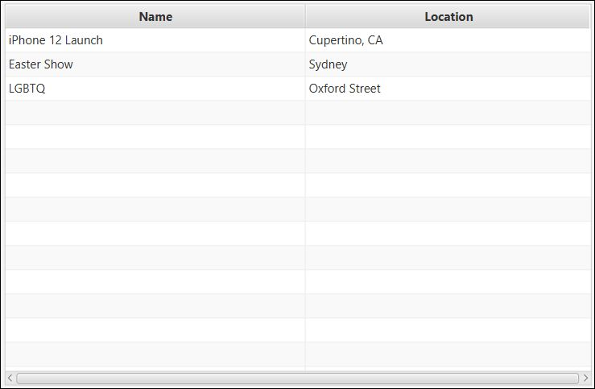

# infs2605-20t1-FlowMerrySpell

# Using the Application

To begin open the application on your NetBeans IDE. To do this open your IDE, click File > Open Project 
then navigate to the application's folder locate th pom.xml file and click Open Project. From your IDE
Clean and Build the application then Run it.

Now you should see the opening screen. Let the instructions begin...

## Instructions for Administrators

To gain administrator access click the "Administrator Login" button to the right.

Login using the administrator credentials below:

Administrator Username | Administrator Password
-------------------- | -----------------------
admin | Password
infs2605marker | BlairIsAwesome2605

When inside you will be able to see the following screen which displays all of the events in the 
database. It displays their Name and their Location. You should see something like this...

Now let's go through how to use the Administrator functions.

### <ins>Adding</ins> and <ins>Viewing</ins> `Guest`s

From the Administrator Dashboard, click the Guest Manager Button at the bottom-right side of the screen.
This opens a new window within you can view the Current Guest List to see all guest currently in the 
database and add new guests to that database.

To add new guests enter the 4 credentials required in the fields at the top of the page (Guest First Name,
 Guest Last Name, Guest Email and Guest Phone). then click the "Generate Access Code" button.

This will then display the automatically generated access code for this new guest. 

To finish adding the guest. Click the "Add Guest" button which appears.

You should now see the new guest details appear in the Current Guest List below.

### <ins>Removing</ins> a `Guest`.

Simply select the guest you wish to delete and click the "Delete Guest" button at the bottom of the 
screen.

### <ins>Adding</ins> a new `Event`.

From the Administrator Dashboard click New and the top-left corner of the screen > Event.

Fields to enter the event details will appear below the events table. They are Name and Location .

Add theses credentials then click the botton titles "Add New Event".

The event will now appear on events table right above. 

### <ins>Editing</ins> an `Event`

Select the event you wish to edit. It will now be highlighted in blue. 

Select "Edit" next to "New". A new window titled "Edit Event" will appear.

Here you can change the Event Name and Event location by simply clicking in the field and typing.

### <ins>Creating</ins> `Invitation`s to be sent to `Guest`s

From the Administrator Dashboard click Edit > Create Invitations. A new page titled Create Invites
 will appear.

This page features a list of all the guests in the application's database. 

To invite 1 guest click that guest and click "Send Invites". Some small green text will then
appear saying "Invites Sent!". 

To invite multiple guests at once click hold Ctrl (or Command for Mac) and click the guests you wish 
to send invitations to simultaneously. Once you have your selection click Send Invites. Again, 
some small green text.

## Instructions for Guests

To login from the Application's home page, click Guest Login and enter your guest Access Code in 
the field on the Venue Brain Guest Login page. Click the "Login" button. 

Here are some sample login credentails

Guest Access Code |
-------------------- | 
BarackObama5637 |
CodyKo7558 |
NeilMatani8724 |
INFSMarker0140 |
JimSlim5894 |

You will new see the Guest Landing page titled, "Guest Dashboard"

It features a table which lists the details of the events they are invited to and some information 
about them (Events Invited [the event's name], Location, Date and RSVP Status [whether
or not they RSVPed to attend the event]) and two buttons titled "RSVP" and "Print Invitation".

Let's get into what guests can do and how they do it.

### Accepting or Declining invitations via an RSVP and adding notes.

!!!! NOT YET ADDED. 

### Printing an Invitation to a PDF

Simply highlight an event in the Guest Dashboard and click "Print Invitation". The PDF file will be in the project folder.

